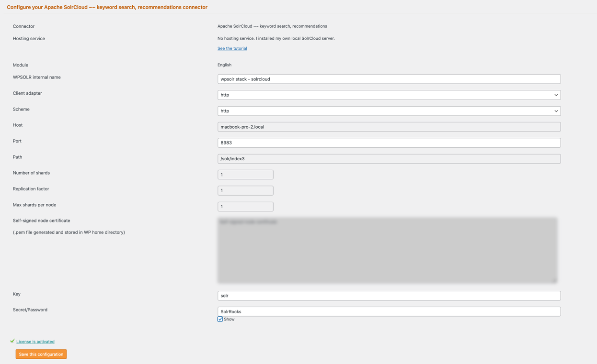

# WPSOLR Apache SolrCloud Stack


[](Zookeeper)


This directory contains a **Docker Compose stack** for running an Apache SolrCloud based backend with WPSOLR.  
It’s intended for **local development and testing** with WordPress + WPSOLR.

---

# WPSOLR SolrCloud Secure Stack

- Apache SolrCloud + ZooKeeper (latest versions)
- Basic Authentication enabled (solr/SolrRocks)
- Persistent storage
- Docker Compose ready

## Quick Start

1. Start the stack:

```bash
docker compose up -d
```

## Access the Solr Admin UI

http://localhost:8983

Login credentials:

* Username: `solr`
* Password: `SolrRocks`

## WPSOLR index settings


---

## Notes

* Docker & Docker Compose must be installed.
* This stack is development-focused; production deployments require additional security, persistence, and resource tuning.

## Production Notes ⚠️ ##

This configuration is for **local development only**.

## License

This project is licensed under the Apache License — see the root `LICENSE` file for full terms.

## Support

For help, issues, or feature requests, open an issue in the [wpsolr-stacks](https://github.com/eostis-sarl/wpsolr-stacks/issues)
GitHub repository.