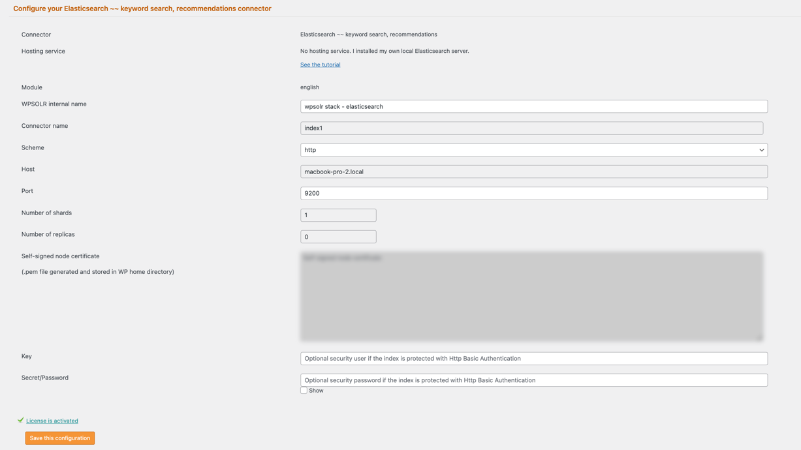

# WPSOLR Elasticsearch Stack


This directory contains a **Docker Compose stack** for running an Elasticsearch based backend with WPSOLR.  
It’s intended for **local development and testing** with WordPress + WPSOLR.

---

## Stack Overview

| Service | Purpose |
|----------|----------|
| **Elasticsearch** | Search and indexing engine |
| **Kibana** | Web-based dashboard and index inspection tool |

- Single-node Elasticsearch with plugin ingest-attachment
- Security disabled for easy local setup
- Persistent data volume
- Shared Docker bridge network

## Quick Start

### 1️⃣ Navigate to the folder

```bash
cd elasticsearch
```
2. **Start the stack:**

```bash
docker compose up -d
```

3. **Verify containers are running:**

```bash
docker compose ps
```
## Access URLs ##
**Elasticsearch**
```
http://localhost:9200
```

Test with:
```
curl http://localhost:9200
```

**Kibana Dashboard**
```
    http://localhost:5601
```

## Configuration Details ## 

### Elasticsearch ###
* Version: 9.3.0
* Mode: single-node
* Security: disabled
* Memory: 1GB heap
* Data persistence: esdata Docker volume

If you need more memory:
```
- ES_JAVA_OPTS=-Xms2g -Xmx2g
```

## WPSOLR index settings


---

## Production Notes ⚠️ ##

This configuration is for **local development only**.

For production:
* Enable xpack.security
* Enable TLS
* Set strong passwords
* Configure resource limits
* Use proper persistent storage

## Stop the Stack ##
```
docker compose down
```


To remove volumes as well:
```
docker compose down -v
```

## Notes

* Docker & Docker Compose must be installed.
* This stack is development-focused; production deployments require additional security, persistence, and resource tuning.

## License

This project is licensed under the Apache License — see the root `LICENSE` file for full terms.

## Support

For help, issues, or feature requests, open an issue in the [wpsolr-stacks](https://github.com/eostis-sarl/wpsolr-stacks/issues)
GitHub repository.