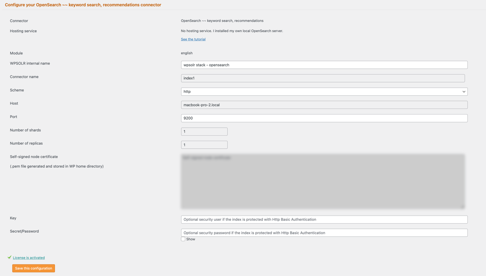

# WPSOLR OpenSearch Stack


This directory contains a **Docker Compose stack** for running an OpenSearch based backend with WPSOLR.  
It’s intended for **local development and testing** with WordPress + WPSOLR.

---

## Stack Overview

| Service | Purpose |
|---------|---------|
| **opensearch** | Secure search & indexing engine |
| **opensearch-dashboards** | Web UI for exploring indices & analytics |

- Single-node deployment
- Security plugin **disabled**
- Persistent data
- Shared Docker network

---

## Quick Start

### Navigate to this folder

```bash
cd opensearch
```

## Set a strong password

Replace StrongPassword123! with a secure password.

## Start the stack
```
docker compose up -d
```

## Verify containers
```
docker compose ps
```

## Access URLs
### OpenSearch

* URL: http://localhost:9200
* No login/password asked

### OpenSearch Dashboards

* URL: http://localhost:5601
* No login/password asked

## WPSOLR index settings


---

## Notes

* Docker & Docker Compose must be installed.
* This stack is development-focused; production deployments require additional security, persistence, and resource tuning.

## Production Notes ⚠️ ##

This configuration is for **local development only**.

## License

This project is licensed under the Apache License — see the root `LICENSE` file for full terms.

## Support

For help, issues, or feature requests, open an issue in the [wpsolr-stacks](https://github.com/eostis-sarl/wpsolr-stacks/issues)
GitHub repository.