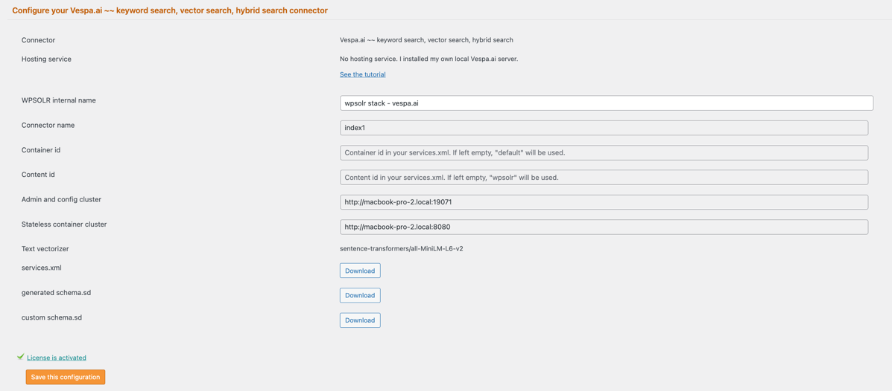

# WPSOLR Vespa.ai Stack

This directory contains a **Docker Compose stack** for running a Vespa.ai based backend with WPSOLR.  
It’s intended for **local development and testing** with WordPress + WPSOLR.

---

# Vespa Docker Stack

Single-node Vespa setup with hybrid (BM25) + vector search.

## Features

- Persistent storage
- HTTP API exposed
- Hybrid ranking profile
- Vector ranking profile
- Docker Compose ready

---

## Start

docker compose up -d

---

## Health

http://localhost:8080/state/v1/health

---

## WPSOLR index settings

---

## Notes

* Docker & Docker Compose must be installed.
* This stack is development-focused; production deployments require additional security, persistence, and resource tuning.

## Production Notes ⚠️ ##

This configuration is for **local development only**.

## License

This project is licensed under the Apache License — see the root `LICENSE` file for full terms.

## Support

For help, issues, or feature requests, open an issue in the [wpsolr-stacks](https://github.com/eostis-sarl/wpsolr-stacks/issues)
GitHub repository.